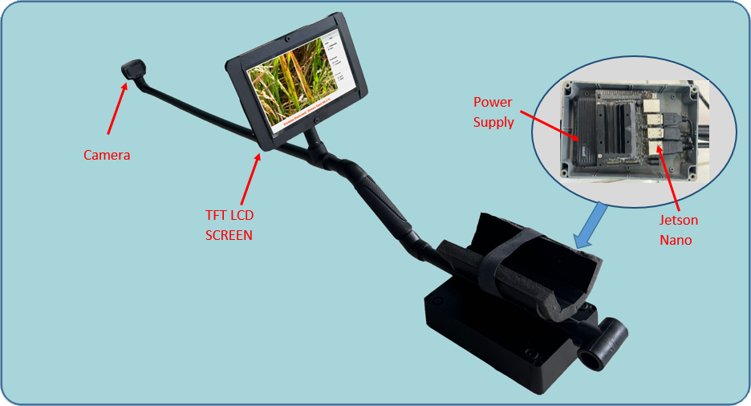

# DBLA-MobileNetV2: Real-Time Rice Leaf Disease Detection on Edge Devices

[](https://opensource.org/licenses/MIT)

This repository contains the official implementation of the paper:

**DBLA-MobileNetV2: Real-Time Rice Leaf Disease Detection on Edge Devices with Dual-Branch Lightweight Attention**

Submitted in IEEE Access (2025).

The proposed DBLA-MobileNetV2 architecture achieves **98.30% accuracy** on the Rice Leaf Diseases dataset while running at **12.4 FPS** on NVIDIA Jetson Nano with TensorRT FP16 quantization.

## Highlights
- Dual-branch architecture with independent SE attention modules
- Lightweight design: only +6.84% parameters and +6.67% FLOPs over MobileNetV2 baseline
- Real-time performance on Jetson Nano (12.4 FPS, 97.9% accuracy)
- Custom arm-mounted hardware prototype for field deployment
- Tested on >1,200 live images in real rice fields
- Full code, pretrained models, TensorRT engines, and GUI included

## Repository Contents
- `rice-leaf-disease-mobilenetv2_1.ipynb`: Complete Jupyter notebook with:
  - Dataset loading and preprocessing
  - Model definition (DBLA-MobileNetV2 + baseline)
  - Training and validation
  - Ablation studies
  - Inference benchmarking
- `models/`: Pretrained models (FP32, FP16, TensorRT engines)
- `gui/`: Real-time inference GUI with model selection (TFLite / TensorRT, FP32 / FP16)
- `images/`: 
  - Hardware prototype photos
  - Field deployment images
  - GUI screenshots
  - Grad-CAM visualizations
- `requirements.txt`: Required Python packages

## Hardware Prototype
 <!-- Görsel ekleyince yolu güncelle -->

Custom arm-mounted stick-shaped device with:
- NVIDIA Jetson Nano (4GB)
- Logitech C310 HD Webcam
- 7-inch display
- 20,000 mAh power bank (~8–10 hours operation)

## Graphical User Interface


## Quick Start

1. Clone the repository:
```bash
git clone https://github.com/mtasci42/DBLA-MobileNetV2.git
cd DBLA-MobileNetV2
```

2. Install dependencies:
```bash
pip install -r requirements.txt
```

3. Run the Jupyter notebook for training/experiments:
```bash
jupyter notebook rice-leaf-disease-mobilenetv2_1.ipynb
```

4. Run real-time inference GUI (on Jetson Nano):
```bash
python gui/inference_gui.py
```

## Dataset
The model was trained on the publicly available Rice Leaf Diseases dataset from Kaggle (6000 images, 5 classes):
- Brown Spot
- Healthy
- Leaf Blast
- Leaf Scald
- Tungro

Dataset links:
- [Dataset 1](https://www.kaggle.com/datasets/vbookshelf/rice-leaf-diseases)
- [Dataset 2](https://www.kaggle.com/datasets/minhhuy2810/rice-diseases-image-dataset)

## Citation

If you use this code or model in your research, please cite:

```bibtex
@article{tasci2025dbla,
  title={DBLA-MobileNetV2: Real-Time Rice Leaf Disease Detection on Edge Devices with Dual-Branch Lightweight Attention},
  author={Tasci, Mustafa},
  journal={},
  year={2025},
  volume={},
  number={},
  pages={},
  doi={} <!-- DOI yayınlandıktan sonra güncellenecektir -->
}
```

## License
This project is licensed under the MIT License - see the [LICENSE](LICENSE) file for details.

## Contact
Mustafa Tasci - mtasci@bandirma.edu.tr

Project Link: https://github.com/mtasci42/DBLA-MobileNetV2
